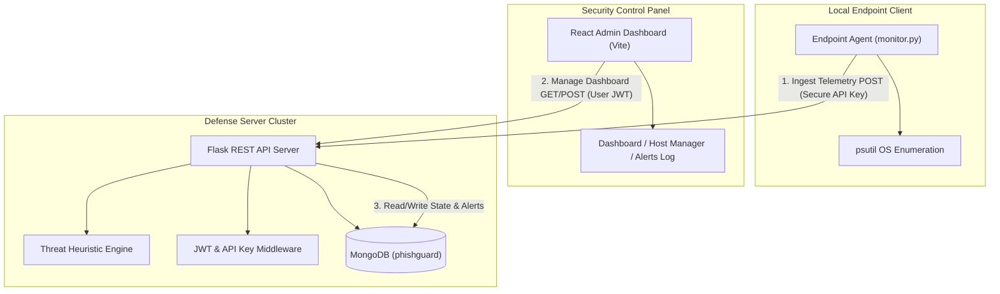

# 🛡️ ShadowWatch: Behavioral Endpoint Telemetry & Threat Intelligence System

ShadowWatch (a security telemetry module within the PhishGuard platform) is an end-to-end security solution designed to detect threat vectors, suspicious process anomalies, and potential keyloggers on client endpoints. Through a lightweight local agent, a secure heuristic-driven Flask backend, and a modern React dashboard, administrators gain real-time visual telemetry and alerting of compromise events across their entire network.

---

## 📐 System Architecture

ShadowWatch uses a decoupled, three-tier architecture ensuring ultra-low client overhead, real-time telemetry processing, and single-pane administrative control.



1. **Endpoint Agent (`agent/monitor.py`)**: A standalone Python agent that runs in the background of target workstations. It collects process attributes, evaluates file-path structures for anomalies, logs system statistics, and securely forwards snapshots using endpoint-specific API keys.
2. **Backend API (`backend/`)**: A secure Flask REST API providing JWT verification for dashboard users and unique API key authorization for endpoint telemetry streams. Houses a zero-I/O scoring engine that maps endpoint states into structured threat profiles in under 1ms.
3. **Frontend Dashboard (`frontend/`)**: A state-of-the-art React 19 + Vite dashboard featuring glassmorphic designs, visual statistics, real-time alert logs, endpoint key rotation, and on-demand diagnostic scans.

---

## 📂 Repository Structure

The workspace is organized logically into isolated client, server, and local agent domains:

```text
Keylogger-Antigravity/
├── agent/                    # Distributable Endpoint Telemetry Agent
│   └── monitor.py            # Standalone behavioral agent (runs on user machines)
│
├── backend/                  # Flask REST API Server (deployed to Render)
│   ├── app/
│   │   ├── config/           # Database & JWT configurations
│   │   ├── models/           # ODM / Schema definition hooks
│   │   ├── routes/           # User, Auth, Endpoint Ingestion, and Scan endpoints
│   │   ├── services/         # Keylogger detection heuristics & Endpoint database operations
│   │   └── utils/            # Authentication, rate limiting, and database abstractions
│   ├── run.py                # Server entry point
│   ├── test_antigravity.py   # Automated unit tests for endpoint scoring logic
│   └── requirements.txt      # Python server dependencies
│
├── frontend/                 # React Single Page Admin Dashboard (deployed to Render)
│   ├── public/               # Static assets & icons
│   ├── src/
│   │   ├── components/       # Common UI elements (Navigation, Alert Indicators)
│   │   ├── context/          # React Auth and Theme global contexts
│   │   ├── pages/            # Dashboard, Endpoint Management, Alerts History, Scanner, Profile
│   │   ├── services/         # Axios API connection middleware
│   │   ├── App.jsx           # Main routing and viewport container
│   │   └── index.css         # Dynamic color variables, gradients, and custom animations
│   ├── package.json          # Node dependencies and Vite building scripts
│   └── vite.config.js        # Vite bundler parameters
│
├── render.yaml               # Render deployment configuration
└── README.md                 # Project-wide operations manual
```

---

## 🧠 Threat Scoring Engine Heuristics

The heart of ShadowWatch is its backend threat scoring system. Incoming process structures and aggregate metrics are parsed dynamically. Accumulated scores trigger specific threat ratings:

### 1. Point Values by Heuristic Rule
| Threat Rule | Score | Description / Condition |
| :--- | :---: | :--- |
| `known_bad_name` | **50** | Matches active threat signatures (e.g., `keylogger.exe`, `perfectkeylogger.exe`, `spyrix.exe`). |
| `suspicious_path` | **40** | Binary is executing from system temp locations (e.g., `C:\Temp`, `\AppData\Local\Temp`, `/tmp`). |
| `suspicious_keyword` | **35** | Process name contains substrings like `keylog`, `hookdll`, `spyware`, `kbhook`, or `winspy`. |
| `hidden_file_creation` | **35** | Endpoint client registers unexpected system modifications or hidden file creation. |
| `rapid_disk_writes` | **30** | Disk write rates exceed 50 operations per second, suggesting high logging activity. |
| `orphaned_process` | **25** | Running binary reports no Parent Process ID (`ppid == 0`), common for injected processes. |
| `appdata_path` | **20** | Executing from user directories like `\AppData\Roaming`, typical of unprivileged payload dropping. |
| `high_cpu` | **15** | Executable CPU consumption remains sustained above **80%**. |

### 2. Threat Classification Thresholds
Based on cumulative score arithmetic:
*   **🟢 SAFE (`0–19`)**: Standard OS operations. No alerts raised.
*   **🟡 SUSPICIOUS (`20–49`)**: Minor infractions, unexpected temporary executions. Heartbeat status updated; alert recorded.
*   **🔴 MALICIOUS (`50+`)**: Confirmed signatures or heavily-layered heuristics. Immediate critical alert pushed to the administrator dashboard.

---

## ⚡ Quick Start Guide

### 📋 Prerequisites
*   **Python 3.8+**
*   **Node.js 16+** (npm v8+)
*   **MongoDB Community Server** running locally at `mongodb://localhost:27017`

---

### 🗄️ Step 1: Initialize the MongoDB Database
Ensure your MongoDB daemon is running locally:
```bash
# Windows (PowerShell/CMD as Admin)
net start MongoDB

# Linux / macOS
sudo systemctl start mongod
```

---

### 🛡️ Step 2: Configure and Run the Backend API
1. Navigate to the backend directory:
   ```bash
   cd backend
   ```
2. Create a virtual environment and activate it:
   ```bash
   # Windows
   python -m venv venv
   .\venv\Scripts\activate

   # Linux / macOS
   python3 -m venv venv
   source venv/bin/activate
   ```
3. Install required Python packages:
   ```bash
   pip install -r requirements.txt
   ```
4. Verify or adjust the `.env` settings:
   ```ini
   MONGO_URI=mongodb://localhost:27017/
   JWT_SECRET_KEY=your_super_secret_jwt_key_here
   FLASK_APP=run.py
   FLASK_ENV=development
   ```
5. Run the server:
   ```bash
   python run.py
   ```
   *The backend REST API will boot on **`http://localhost:5000`**.*

---

### 🖥️ Step 3: Start the React + Vite Frontend
1. Open a new terminal and navigate to the frontend directory:
   ```bash
   cd frontend
   ```
2. Install npm packages:
   ```bash
   npm install
   ```
3. Start the Vite hot-reloading development server:
   ```bash
   npm run dev
   ```
   *The visual security dashboard will launch at **`http://localhost:5173`**.*

---

### 🕵️ Step 4: Provision and Deploy the Endpoint Telemetry Agent
1. Open the ShadowWatch dashboard (`http://localhost:5173`) and sign in or create an account.
2. Navigate to the **Endpoints** page.
3. Register your machine's hostname (e.g. in your command line, run `hostname` or `echo %COMPUTERNAME%` to get it).
4. **Copy the One-Time Plaintext API Key** generated by the dashboard (looks like `ag-d41d8cd98f00b204e980...`).
5. Run the telemetry agent on your endpoint:
   ```bash
   # Make sure dependencies are installed in your agent environment:
   pip install psutil requests

   # Execute the monitoring loop
   python agent/monitor.py --server http://localhost:5000 --api-key ag-<your_copied_api_key>
   ```
   *The agent will collect process telemetry every **30 seconds** (default), scoring and logging threat activity instantly.*

   > **Tip:** Pass `--debug` to see verbose per-request logs, or use `--interval <seconds>` to change the poll rate.

---

## 🔒 Security and Performance Design

*   **API Security**: Endpoint telemetry uses **SHA-256 secure hashing** to verify API keys. Only the hashes are stored in MongoDB. The plaintext token is shown exactly once upon provisioning.
*   **Client Safety Target**: Process enumeration uses `psutil.process_iter().oneshot()` batch caching to perform single-kernel fetches for all details. The agent hits a **sub-1% CPU overhead target** at the default poll rate.
*   **Robust Network Resiliency**: The endpoint agent implements exponential back-off retries (`time.sleep(min(5 * (2**(failures-1)), 120))`) so that temporary network dropouts or backend updates do not crash the service.
*   **Database Indexing**: Automatic index creation maps critical indexes (`user_id_1`, `hostname_1`, `api_key_hash_1`, etc.) on start to protect database search speed and avoid slow full-collection scans.

---

## 🧪 Running Automated Tests
The suite tests telemetry validation schema structures, registration methods, and threat scores.
To run the automated Python backend tests:
```bash
cd backend
python test_antigravity.py
```

---

*Designed and implemented as an enterprise-grade behavioral telemetry solution for advanced network security.*
